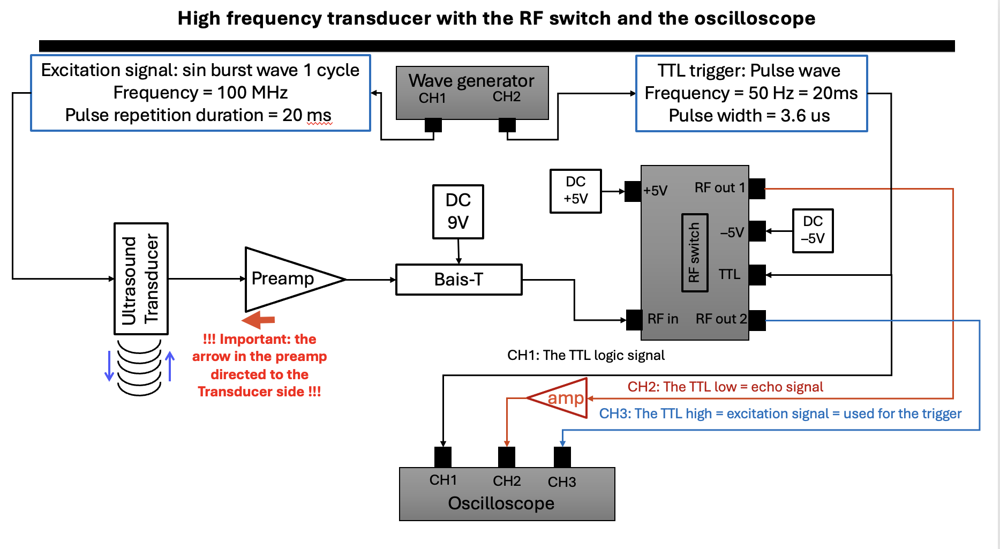

# Pulse-echo measurements
The pulse-echo platform is used mainly for characterizing the polymer film used in the optical-ultrasound sensor, with a resolution of 1 µm using XYZ scanning. It is an automated system that integrates the motors, the wave generator, and the oscilloscope to acquire the signal from different positions of the sensor and at different focal points of the ultrasound sensor.

The electronic circuit of the pulse-echo system is shown in the following scheme:

The system is controlled from the main script in MATLAB, which communicates with the motors, the wave generator, and the oscilloscope:

1. The main script: `Pulse_echo_mainScript.m`
2. The wave generator class: `DG5000Pro.m`
3. The oscilloscope class: `T3DSO2502A.m`
4. The motor class: `PIMotorController.m`

The signal processing and analysis were done using a graphical user interface (GUI):

